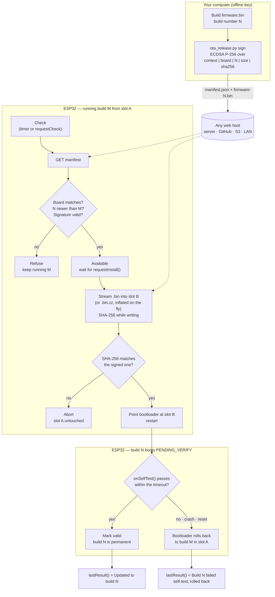

# SKL-OTA

Signed, rollback-safe OTA updates for ESP32. The board, build number and image hash are signed together, so devices refuse old, foreign or tampered builds, and roll back if a new build fails its self-test.

Built by [Shady Knoll Labs](https://shadyknolllabs.com) for the Gnode plant sensor, and usable in any Arduino-ESP32 project.

## Why

Most OTA code treats a finished download as a finished update:

```
Downloaded ✓   Written ✓   Rebooted ✓   → success
```

SKL-OTA doesn't count it as a success until the new firmware is actually working:

```
Signature ✓   Newer build ✓   Hash ✓   Rebooted ✓   Your self-test passes ✓   → success
                                                     (fails, crashes, resets → old build is back)
```

The device installs only firmware you signed with a key that never leaves your computer, and only if it's newer than what's running. If the new build doesn't come up healthy, the device goes back to the old one by itself. What counts as "healthy" is up to you: your code supplies the self-test.

- **Signed releases only.** Each release's manifest carries an ECDSA P-256 signature over its board, build number, size and SHA-256. The device checks it against the public key compiled into the firmware. Signing can't be turned off, so the server, the CDN, or anyone in between can't push code you didn't sign.
- **Newer builds only.** A device refuses any build number at or below its own, so an old signed build with a known bug can't be replayed onto it.
- **The running firmware is never touched.** The update streams into the other app slot and is hashed as it arrives. The device switches slots only if the SHA-256 matches the signed one. A dropped connection, a full slot or a corrupted file leaves the old firmware running.
- **Automatic rollback.** The new build boots "pending" and must pass your self-test (sensors found, server reachable, whatever "working" means for your product) within 10 minutes. If it crashes, resets or fails first, the bootloader goes back to the previous build. The outcome is saved, so the device can report it.
- **Compressed downloads.** Each release also ships as a zlib-compressed copy, about a third smaller (a 1.34 MB Gnode image downloads as 859 KB). The device inflates it as it arrives, using the decompressor already in the ESP32's ROM, so it costs no flash. It still has to match the signed hash byte for byte. Devices that don't know about compression just download the plain image.
- **Host it anywhere.** The manifest and `.bin` are plain files: your own server, GitHub releases, S3, a Raspberry Pi on your LAN. Security comes from the signature, not from where the files live.
- **Doesn't block `loop()`.** Checks and installs run in their own task with the stack TLS and ECDSA need. Log lines come back through `loop()`, so your logger never runs on another task.
- **Checks automatically, installs only when asked.** It checks 5 minutes after boot and every 12 hours after that (both configurable), but only installs when your code calls `requestInstall()`.

## Do you need it?

It depends on how far the device is from a USB cable.

- **One board on your desk, your WiFi, your server.** Probably not. If an update goes wrong you plug in USB and reflash. [esp32FOTA](https://github.com/chrisjoyce911/esp32FOTA) already gives you HTTPS, signatures, hashes and versions.
- **A device somewhere awkward:** on a roof, inside a wall, in a greenhouse, at a customer's house. This is where **automatic rollback** earns its keep. A bad build fixes itself instead of costing you a ladder, a drive or a support call.
- **Hundreds or thousands of devices.** Here the worry isn't "someone might tamper with my firmware". It's "I just bricked 3,000 devices with one release", or "the wrong build reached the wrong hardware", or "an old build with a known bug came back". Rollback deals with the first. Signing the board and build number together deals with the other two. For a fleet these are everyday risks, not edge cases.

## How it works



<sub>Diagram not rendering where you're reading this? [See it as an image](docs/how-it-works.png).</sub>

Three gates stand between a file on a server and your device running it:

1. **Before download:** the manifest's signature must verify with your public key. That signature covers the board, build number, size and hash together, so none of them can be swapped.
2. **After download:** the `.bin` must hash to exactly the SHA-256 that was signed. Until it does, the running firmware is never touched.
3. **After restart:** the new build has to prove it works. If it can't, the bootloader puts the old one back without anyone touching the device.

## What SKL-OTA adds, and what the ESP32 already does

SKL-OTA didn't invent A/B slots or rollback. Those come from the ESP32 itself:

- **ESP-IDF and the bootloader provide:** two app slots, switching between them, and marking a new image "pending verify". If that image is never marked valid, the bootloader goes back to the previous slot at the next reset.
- **SKL-OTA provides:** a release format that signs the board, build number, size and hash together; refusing old and foreign builds; checking the hash while the image streams in; a self-test window your code defines, with a timeout that triggers the rollback itself; a result that survives the reboot; and all of it in a background task with one small API.

That's why it needs two app slots and rollback enabled (see [Install](#install)). The value isn't one new trick. It's tying the ESP32's built-in rollback to a signed release and a definition of "working" that your code supplies.

## How it differs from esp32FOTA

[esp32FOTA](https://github.com/chrisjoyce911/esp32FOTA) is the best-known ESP32 pull-OTA library. It's mature, widely used, and does things SKL-OTA doesn't (filesystem image updates, semantic versions). It also supports signed firmware. The difference is **what** gets signed and **what happens after** the update. (Comparison based on esp32FOTA's README, October 2026.)

| | esp32FOTA | SKL-OTA |
|---|---|---|
| Signature algorithm | RSA (signature attached to the `.bin`) | ECDSA P-256 (signature in the manifest) |
| What the signature covers | The firmware image | The **release**: board + build number + size + SHA-256 of the image |
| Version / board in the manifest | Not signed | Signed |
| Serve an **older** signed build to a device | Accepted if the server says it's newer: the version check uses the unsigned manifest | Refused: the build number is signed, and only higher builds install |
| Serve a build signed for **other hardware** | Accepted if the signature is valid | Refused: the board is signed |
| Signing required | Optional | Always on: there's no unsigned mode |
| Firmware that installs but doesn't work | Stays installed (no rollback documented) | Rolled back automatically if `onSelfTest()` doesn't pass in time |
| Result after reboot | Not documented | `lastResult()` survives the reboot, so the device can report "updated" or "rolled back" |
| Where the work runs | Wherever you call it, blocking until done | Its own FreeRTOS task. Log lines come back on `loop()` |
| Filesystem (SPIFFS/LittleFS) updates | Yes | No (app image only) |
| Version format | Semantic versions | One whole number that only goes up (e.g. a git commit count) |

**Why signing the release matters.** Signing only the image proves *you built it*. It doesn't prove *you meant this device to run it now*. Every build you ever signed stays valid forever, including the one with the bug you fixed last month. Anyone who controls the update server, its DNS, or a plain-HTTP network path can serve that old build with a manifest calling it "newer", and the device installs it. SKL-OTA signs the build number and board together with the hash, so a device only accepts a build you signed for that hardware, at a number above what it already runs.

**Why rollback matters.** A correctly signed build can still be broken: a sensor driver that hangs, a WiFi change that never reconnects. Without rollback that device stays broken until someone plugs in a USB cable. SKL-OTA uses the ESP32 bootloader's rollback support, so a build that crashes, resets, or fails your self-test is replaced by the previous one automatically.

Use esp32FOTA if you need filesystem updates or semantic versions, can reach your devices with a cable, and control the whole delivery path. Use SKL-OTA when a bad release has to fix itself (see [Do you need it?](#do-you-need-it)) or the update path isn't fully trusted, such as a home network, plain HTTP, or third-party hosting.

## Install

PlatformIO, from GitHub:

```ini
lib_deps =
    https://github.com/mabbott2011/SKL-OTA.git#v1.0.0
```

Or copy this folder into your project's `lib/` directory. It depends on [ArduinoJson](https://arduinojson.org) 7; everything else (HTTPClient, Update, Preferences, mbedTLS) ships with the Arduino-ESP32 core.

It needs:

- **A partition table with two app slots** (`ota_0` / `ota_1` plus `otadata`). The Arduino IDE's "Default 4MB with spiffs" and PlatformIO's default table both have them. A device on a single-slot table (such as `huge_app.csv`) needs one USB flash with a two-slot table first. Keep the `nvs` and filesystem offsets the same and their contents survive. `Ota.supported()` tells you which layout a device has.
- **Bootloader rollback enabled** (`CONFIG_APP_ROLLBACK_ENABLE`). It's on in the Arduino-ESP32 2.x core. The library overrides the core's `verifyRollbackLater()`, so the new image stays pending until the self-test decides.

## Quick start

### 1. Make your signing key (once per product)

```sh
pip install cryptography
python tools/ota_release.py keygen
```

This writes the **private key** to `~/.skl/ota-signing-key.pem`. Back it up offline and never commit it. Lose it and your devices can't be updated over the air again. Leak it and someone else can.

It also writes the **public key** to `include/ota_pubkey.h` as `OTA_PUBKEY_PEM`. Commit that one. Every build you ship must include it.

### 2. Set it up in your firmware

```cpp
#include <WiFi.h>
#include <SKLOta.h>
#include "ota_pubkey.h"

#define BUILD 7   // raise with every release

void setup() {
  // ... WiFi.begin(...) ...
  Ota.setManifestUrl("https://example.com/fw/manifest.json");
  Ota.onLog([](int sev, const char* msg) { Serial.println(msg); });
  Ota.onSelfTest([](String& status) {        // what "working" means for you
    bool ok = sensorFound && WiFi.status() == WL_CONNECTED;
    status = ok ? "ok" : "sensor or WiFi missing";
    return ok;
  });

  SKLOtaConfig cfg;
  cfg.publicKeyPem = OTA_PUBKEY_PEM;
  cfg.board = "kitchen-sensor-v2";   // releases for other hardware are refused
  cfg.build = BUILD;
  Ota.begin(cfg);
}

void loop() {
  Ota.loop();
  if (userPressedUpdate) Ota.requestInstall();
}
```

A git commit count works well as the build number (`git rev-list --count HEAD`) because it only ever goes up.

### 3. Release a build

Build as usual, then sign it:

```sh
python tools/ota_release.py sign --bin .pio/build/esp32dev/firmware.bin \
    --board kitchen-sensor-v2 --build 8 --version "$(git rev-parse --short HEAD)" \
    --url-base https://example.com/fw
```

This writes `releases/8/firmware-8.bin`, a compressed copy `firmware-8.bin.zz`, and `releases/8/manifest.json`:

```json
{
  "board": "kitchen-sensor-v2",
  "build": 8,
  "version": "cc800ce",
  "url": "https://example.com/fw/firmware-8.bin",
  "size": 1315181,
  "sha256": "9f2c…",
  "sig": "3045…",
  "compression": "zlib",
  "compressed_url": "https://example.com/fw/firmware-8.bin.zz",
  "compressed_size": 842113
}
```

Upload all three so your manifest URL returns that JSON, and the files are at its `"url"` and `"compressed_url"`. A URL that starts with `/` is taken relative to the manifest's host. The three `compressed` fields are optional: leave them out (`sign --no-compress`) and devices download the plain image. Before you upload, check the release the same way a device will:

```sh
python tools/ota_release.py verify releases/8/manifest.json
```

Your manifest URL can also point at your own server code instead of a static file. Return the newest build that device should get, or **204 / 404** when there's nothing for it. That's how you run beta and stable channels, or roll out to some devices first.

## API

### Setup (before `begin()`)

| Call | What it does |
|---|---|
| `setManifestUrl(const char* url)` | Where to fetch the manifest. |
| `setManifestUrl(String (*)())` | The same, as a function that runs at every check, so the URL can come from your settings. |
| `onLog(void(int severity, const char* msg))` | Log lines: 1 error, 2 warning, 3 info. Always called from `loop()` or `begin()`. |
| `onRequest(void(HTTPClient& http, const char* url))` | Add headers (device ID, API key, current build…) to the manifest and `.bin` requests. Check `url` so credentials only go to your own server. Runs on the update task. |
| `onSelfTest(bool(String& status))` | Return `true` once a new build is healthy, and put a short summary in `status` for the failure log. Runs in `loop()`, only while a new build is pending. Not set: the build passes once it has stayed up `selfTestMinUptimeMs`. |
| `onNetworkReady(bool())` | Whether automatic checks may run right now. Default: WiFi is connected. |
| `onChange(void())` | The state, message or progress changed (e.g. redraw a screen). Can run on any task, so keep it to setting a flag. |
| `onRestart(void())` | The new image is written and verified. Default: wait 2 s, then `ESP.restart()`. Replace it to restart from `loop()` after saving state. |
| `onRollback(void(const char* why))` | The self-test failed and the device is about to reboot into the previous build. Save state or show a message. |
| `begin(const SKLOtaConfig&)` | Reads the saved install record and starts the self-test if this is a fresh update. Call once in `setup()` after your logger is ready. |
| `loop()` | Call every `loop()` pass. Cheap when there's nothing to do. |

### Actions (safe from any task: web handlers, buttons, console)

| Call | What it does |
|---|---|
| `requestCheck()` | Check for a newer signed build. Ends in `Available`, `UpToDate` or `Failed`. |
| `requestInstall()` | Install the build on offer (checks first if needed), then restart into it. |

### Status

| Call | Returns |
|---|---|
| `state()` | `SKLOtaState::Idle`, `Checking`, `UpToDate`, `Available`, `Installing` or `Failed` |
| `stateName()` | The same as text: `"idle"`, `"checking"`, `"up_to_date"`, `"available"`, `"installing"`, `"failed"` |
| `message()` | One line for a screen or status page, e.g. `"Build 8 available"`, `"Signature check FAILED"` |
| `progress()` | Install progress 0–100, or -1 |
| `offer()` | The verified release on offer (`build`, `version`, `size`, `url`, and `zurl` / `zsize` when there's a compressed copy) when the state is `Available` |
| `lastResult()` | Outcome of the last install, kept across reboots: `"Updated to build 8"` or `"Build 8 failed self-test; rolled back"` |
| `pendingVerify()` | `true` while a new build is still proving itself. Installs wait until it's done. |
| `supported()` | `false` on a single-app-slot partition table |
| `busy()` | A check or install is queued or running |
| `build()` | The running build number from the config |

### `SKLOtaConfig`

| Field | Default | |
|---|---|---|
| `publicKeyPem` | — | **Required.** `OTA_PUBKEY_PEM` from `keygen`. |
| `board` | — | **Required.** Must match the manifest's `"board"`. |
| `build` | `0` | The running build number. Only higher builds install. |
| `signContext` | `"skl-ota"` | First field of the signed message. Use your product's name so a signature made for one product can't be used on another that shares a key. Pass the same value to `sign --context`. |
| `nvsNamespace` | `"skl_ota"` | NVS namespace for the install record and last result. |
| `firstCheckMs` | 5 min | First automatic check after boot. `0` turns automatic checks off. |
| `checkIntervalMs` | 12 h | Time between automatic checks. `0` means only the first one. |
| `selfTestMinUptimeMs` | 1 min | A new build must stay up at least this long… |
| `selfTestTimeoutMs` | 10 min | …and pass its self-test within this, or it's rolled back. |
| `taskStack` | 12288 | Stack bytes for the check/install task. |
| `allowCompressed` | `true` | Download the compressed copy when the manifest offers one. It needs about 44 KB of free heap during the install (a 32 KB window plus the decompressor's state), freed afterwards. If the compressed download fails before anything is written, the device falls back to the plain image. |

## What the device sees

| Situation | `state()` / `message()` |
|---|---|
| Nothing newer | `UpToDate` / "Up to date (build 7)" |
| Server returns 204 or 404 | `UpToDate` / "No updates published" |
| Wrong board in the manifest | `Failed` / "Update is for other hardware" |
| Signature doesn't verify | `Failed` / "Signature check FAILED" |
| Download corrupted | `Failed` / "Checksum mismatch -- file corrupted" (old firmware keeps running) |
| Image too big for the slot | `Failed` / "Update too big for slot" |
| Single-slot partition table | `Failed` / "Needs USB flash w/ OTA layout" |

## Security notes

- **Keep the private key offline.** Anyone who has it can sign firmware your devices will install. Keep it on the machine you release from, plus an offline backup. Don't put it on the update server or in CI.
- **TLS is optional.** The signature already proves the firmware is yours, so plain HTTP on a LAN is safe for the firmware itself. Use HTTPS if your `onRequest` headers carry credentials.
- **Rotating the key** takes two releases: one signed with the old key that contains the new public key, then everything after it signed with the new key.
- **Downgrades are blocked by design.** To go back, release the old code with a new, higher build number.
- **The compressed copy isn't signed separately; what it inflates to is.** The device decompresses the stream *before* it can check the result, so a hostile server can feed the decompressor bad data. That data only reaches the unused update slot, and the update is refused unless the output matches the signed size and SHA-256. The decompressor (tinfl, in the ESP32's ROM) is the same one the chip's ROM uses when esptool flashes a compressed image over serial. If you'd rather not decompress anything unverified, set `allowCompressed = false`.

## Tests

`test/host/run.sh` builds the streaming decompressor against [miniz](https://github.com/richgel999/miniz)'s tinfl (the same code the ESP32 has in ROM) and checks it on a real firmware image: reads from 1 byte to 64 KB, a truncated stream, a corrupted byte, a bad Adler-32 checksum, extra bytes after the end, and a failed flash write.

```sh
git clone -b 3.0.2 https://github.com/richgel999/miniz.git
MINIZ_DIR=miniz test/host/run.sh path/to/firmware.bin
```

## Example

[`examples/Basic`](examples/Basic/Basic.ino) checks a manifest URL and installs when you type `update` in the Serial Monitor.

## License

MIT. See [LICENSE](LICENSE).
